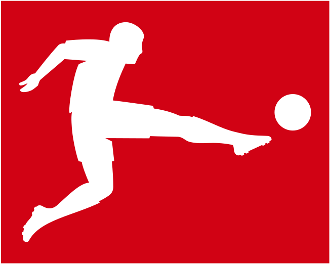
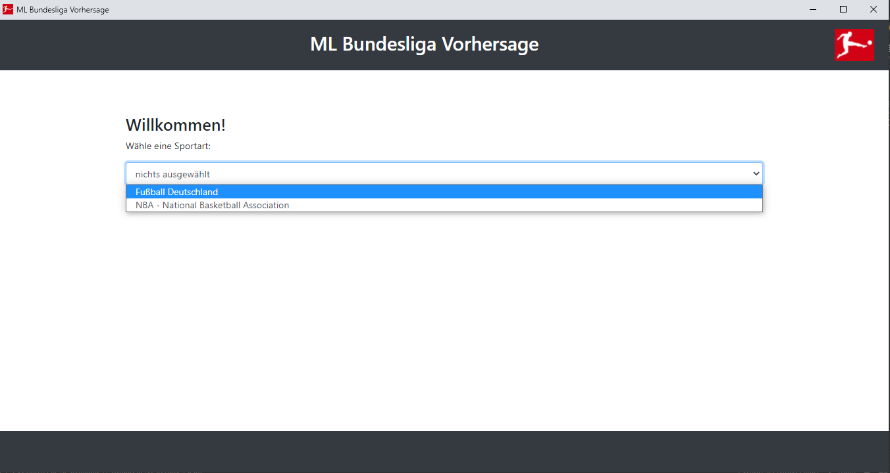
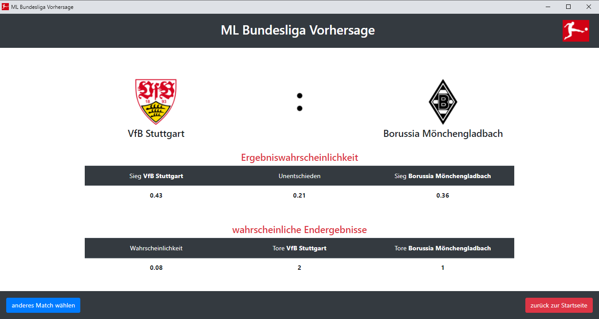

Teamproject Sportvorhersage |Bundesliga-Logo|
-----------

|Maintenance no| |made-with-python| |made-with-javascript| |MIT license|
|Open Source Love svg2| |simpleicons git| |Safe|

.. |Maintenance no| image:: https://img.shields.io/badge/Maintained%3F-no-red.svg
   :target: https://bitbucket.org/lbesson/ansi-colors

.. |made-with-python| image:: https://img.shields.io/badge/Made%20with-Python-1f425f.svg
   :target: https://www.python.org/

.. |made-with-JavaScript| image:: https://img.shields.io/badge/Made%20with-JavaScript-1f425f.svg
   :target: https://www.javascript.com

.. |MIT license| image:: https://img.shields.io/badge/License-MIT-blue.svg
   :target: https://lbesson.mit-license.org/

.. |simpleicons git| image:: https://img.shields.io/badge/--F05032?logo=git&logoColor=ffffff
   :target: http://git-scm.com

.. |Open Source Love svg2| image:: https://badges.frapsoft.com/os/v2/open-source.svg?v=103
   :target: https://github.com/ellerbrock/open-source-badges/

.. |Safe| image:: https://img.shields.io/badge/Stay-Safe-red?logo=data:image/svg%2bxml;base64,PHN2ZyBpZD0iTGF5ZXJfMSIgZW5hYmxlLWJhY2tncm91bmQ9Im5ldyAwIDAgNTEwIDUxMCIgaGVpZ2h0PSI1MTIiIHZpZXdCb3g9IjAgMCA1MTAgNTEwIiB3aWR0aD0iNTEyIiB4bWxucz0iaHR0cDovL3d3dy53My5vcmcvMjAwMC9zdmciPjxnPjxnPjxwYXRoIGQ9Im0xNzQuNjEgMzAwYy0yMC41OCAwLTQwLjU2IDYuOTUtNTYuNjkgMTkuNzJsLTExMC4wOSA4NS43OTd2MTA0LjQ4M2g1My41MjlsNzYuNDcxLTY1aDEyNi44MnYtMTQ1eiIgZmlsbD0iI2ZmZGRjZSIvPjwvZz48cGF0aCBkPSJtNTAyLjE3IDI4NC43MmMwIDguOTUtMy42IDE3Ljg5LTEwLjc4IDI0LjQ2bC0xNDguNTYgMTM1LjgyaC03OC4xOHYtODVoNjguMThsMTE0LjM0LTEwMC4yMWMxMi44Mi0xMS4yMyAzMi4wNi0xMC45MiA0NC41LjczIDcgNi41NSAxMC41IDE1LjM4IDEwLjUgMjQuMnoiIGZpbGw9IiNmZmNjYmQiLz48cGF0aCBkPSJtMzMyLjgzIDM0OS42M3YxMC4zN2gtNjguMTh2LTYwaDE4LjU1YzI3LjQxIDAgNDkuNjMgMjIuMjIgNDkuNjMgNDkuNjN6IiBmaWxsPSIjZmZjY2JkIi8+PHBhdGggZD0ibTM5OS44IDc3LjN2OC4wMWMwIDIwLjY1LTguMDQgNDAuMDctMjIuNjQgNTQuNjdsLTExMi41MSAxMTIuNTF2LTIyNi42NmwzLjE4LTMuMTljMTQuNi0xNC42IDM0LjAyLTIyLjY0IDU0LjY3LTIyLjY0IDQyLjYyIDAgNzcuMyAzNC42OCA3Ny4zIDc3LjN6IiBmaWxsPSIjZDAwMDUwIi8+PHBhdGggZD0ibTI2NC42NSAyNS44M3YyMjYuNjZsLTExMi41MS0xMTIuNTFjLTE0LjYtMTQuNi0yMi42NC0zNC4wMi0yMi42NC01NC42N3YtOC4wMWMwLTQyLjYyIDM0LjY4LTc3LjMgNzcuMy03Ny4zIDIwLjY1IDAgNDAuMDYgOC4wNCA1NC42NiAyMi42NHoiIGZpbGw9IiNmZjRhNGEiLz48cGF0aCBkPSJtMjEyLjgzIDM2MC4xMnYzMGg1MS44MnYtMzB6IiBmaWxsPSIjZmZjY2JkIi8+PHBhdGggZD0ibTI2NC42NSAzNjAuMTJ2MzBoMzYuMTRsMzIuMDQtMzB6IiBmaWxsPSIjZmZiZGE5Ii8+PC9nPjwvc3ZnPg==
   :target: https://www.flaticon.com/free-icon/heart_3555817

What is our project about?
======
This project was started as a university team project, the goal being to predict the outcomes of
games in the german Premier-League, the Bundesliga. Being programmed in a modal and abstract manner,
this algorithm features easy ways to tie in and predict various other sports, provided only that they
feature a quantifiable way to track scores. One example of this flexibility is our already implemented
adaptation of basketball, more specifically the US' NBA.

To elaborate further on what this project is about: we wanted to utilize past data to find
clever algorithms and machine learning models,
striving to accurately predict future outcomes using the aforementioned models.

With more features however, came a more complex user interaction. As a means of counteracting this,
we built a web based, streamlined User Interface to guide the user through this extensive selection process.
Advanced settings in the UI are pre selected, allowing newer users to easily navigate, without needing
detailed knowledge of the algorithms capabilities, while giving more experienced users direct access to
fine tuned predictions.

The resulting predictions are dependant on the algorithm used, simpler models merely return the chances for
a draw or win for either team, whereas the more complex machine learning models may also give a concrete score
predicted for the match.

There is a lot more to be discovered, so let's get started with the

Visuals
======
To give you a glimpse of our User Interface and how to navigate through, we decided to show you
these two screenshots.
The first of which shows our starting screen, where you select the sport you'd like to predict.
As you can see, the selections take place over multiple pages, letting us hide unnecessary menus
and display only those that we need for the selected sport and algorithm.
To prevent incomplete inputs, the button to continue to the next site, only appears once a selection has been made.

|start_screen|

After choosing the sport, general data and model to be used, the advanced selection will appear.
This page lets you fine tune your data down to the day, when choosing what the model will train on,
as well as what teams or matches you want to predict. following it is the page displayed below,
it shows the predicted possibilities for each outcome and in addition to that (courtesy of the poisson model),
a prediction for the resulting score.

|prediction_screen|

Installation
======
Bla, wie erstellt man das richtige Environment.

Once you've activated the environment, install the current package and its
dependencies using::

    cd ML-Bundesliga
    pip install -e .

Usage
======
After the package and all dependencies are installed,
you can execute the code contained in the teamproject/__main__.py file by executing this command::

    python -m teamproject

If you have executed the pip install line above, you may instead use::

    teamproject

Special Advantages
======
**What was our focus while developing?**

Our project stands out in terms of the user experience. We realised our user interface with **eel**,
a python library that allows you to create offline user interfaces structured like websites.
Because we chose this implementation the project is cross-platform, which allows for a wider audience.

We also focused on robustness and accessibility. Therefore it is possible to jump to any of the previous steps
of the program, and if you accidentally refresh the page, you will still be in the same step of the process.
Furthermore, all images support alt-text, the UI can be used with either only a keyboard or mouse
and the simplistic design emphasizes usability.

Outside of the User Interface, the focus on flexibility led us to design the crawler and prediction algorithms
as abstract classes. This allows for a modular build, in which additional algorithms or crawlers are automatically
integrated by the UI, reducing the needed work to add new sports, leagues or prediction models.

**Which Algorithms did we use?**

We implemented four different algorithms. The first one is short and sweet algorithm, we called it **MostWins**.
It filters the given dataset for the selected match up and enumerates all past results.
Once this is completed, the algorithm makes a simple prediction and,
as the name implies, returns the chances of a win for either team or draw occurring.

The second one uses the **Poisson Model** to predict the amount of goals (or any quantifiable scoring value).
The predicted values are displayed as a Matrix, where each entry represents one possible outcome to the game
with X and Y axis representing each Teams score.

The third model is the **Dixon-Coles Model**, an improvement upon the Poisson Model, iterating over the given data
repeatedly to increase accuracy at the expense of computing time. A selection can be made, whether to weigh all
data equally, or progressively according to age.

And the last standard model is the **Logistic Regression Model**. It calculates a table of factors using the logistic
regression function, each entry representing a modifier to the game, such as home-field advantage or simply the teams
overall success in the past.

Tests
======
There are thorough tests written with pytest for both the models and crawler functions. These can be found in the 'tests'
folder and executed with the following commands::

    python -m pytest tests/test_crawler.py
    python -m pytest tests/test_models.py

Project Status
======
active

Authors and Acknowledgement
======
The authors are Stephan Amann, Cornelius Bopp, David Kleindiek and Amelie Schäfer.
This project started as an university assignment, therefore we acknowledge and thank our tutors
Felix Dangel, Thomas Gläßle and Frank Schneider for their feedback and generous help.

License
======
This project is licensed under the permissive open source MIT license.
